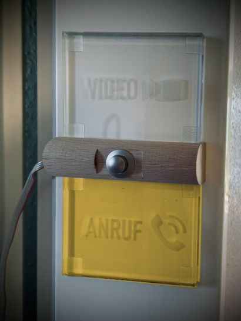
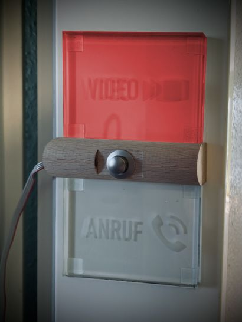
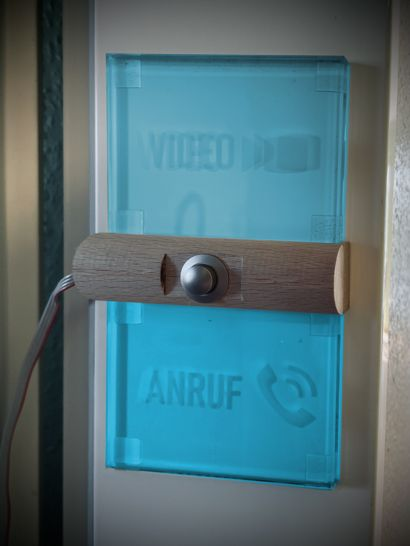
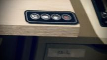

# Home Office Light Indicator :flashlight: :rotating_light:

The COVID-19 crisis changed the life of all of us. Working at home became normal
and a crucial test for anyone living in an apartment with at least one roommate.

## :bulb: The idea

This is why I ~~got bored and~~ made a Home Office Indicator light using **LED
strips attached to two engraved glass tiles**! Those tiles are mounted outside
my (very small) office room and indicate to the outside world whether I am in an
important call or video conference, not wanting to be disturbed. Plus, a ring
button is attached to it which produces a buzzer sound inside.

The entire device is running on a Raspberry Pi in a Docker container with a web
frontend. A few push buttons mounted at my desk and attached to an Arduino Yún -
which I call *the Remote* - control the state of the Home Office Light via
network. Of course, the light can also be turned to any state from any device
within the local network, too.

> Since I'm no longer living in the apartment when I had this Home Office
Indicator up and running, I archived this repo and won't keep it up
to date. :headstone:

## :traffic_light: The Light

The light implements a simple state machine running 5 modes/states in total.

|Idle|Call|Video|Ring (flashing)|
|---|---|---|---|
|||||

- **:no_entry: Idle**: Nothing going on at all.
- **:telephone_receiver: Call**: The bottom glass tile with "Call" engraving
  lights up yellow.
- **:movie_camera: Video**: The top glass tile with "Video" engraving lights up
  red. Also, the button between the glass tiles becomes active and triggers the
  "Ring" mode when pressed.
- **:bell: Ring**: Both glass tiles are flashing light-blue to indicate the
  request to the inside. A buzzer sounds once as an acoustic signal, too. After
  30s, the light automatically falls back to "Video" mode.
- **:rainbow::unicorn: Unicorn mode:** The device goes completely crazy and
  flashes in all rainbow colors very quickly! While this mode is a must-have and
  only intended for fun, it may considered as a signal that you're really
  annoyed of a specific customer and need a cup of coffee *very quickly*...

> When I moved out of the apartment, I realized that I had no photos of the
device at all, so I quickly made one right before disassembling it. At this
time, I already cut the data cable, so I could not take a picture or video of
the real action (e.g. the Unicorn mode! :cry:), so I just edited the "Idle"
photo to give you a vague impression how it looked like.

## :joystick: The Remote

These 4 little membrane keys directly control the state of the Home Office
Indicator. They trigger the attached Arduino to send a state request to the
Raspberry Pi controlling the light instance. (Again, this is unfortunately the
only photo I've got.)

