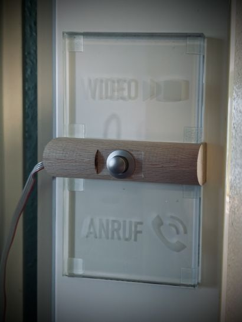

# Home Office Light Indicator

The COVID-19 crisis changed the life of all of us. Working at home became normal
and a crucial test for anyone living in an apartment with multiple people.

This is why I made a **Home Office Indicator** light using LED strips attached to
two engraved glass tiles! Those tiles were mounted outside my (very small)
office room and indicate whether I was in an important call or video conference,
not wanting to be disturbed. Plus, a ring button was attached to it which made a
buzzer sound inside. The entire device was running on a Raspberry Pi in a Docker
container with a web frontend. A few push buttons mounted at my desk and
attached to an Arduino Yun - which was *"the remote"* - could control the state of the Home Office Light via network. Of course, the light could also be controlled from any device inside my local network, too.

> I'm no longer living in the apartment when I had this indicator up and
running, so I archived this repo. :sad:

## The Light

The light consists of a state machine running 5 modes in total.

- **Idle**: Nothing at all.
- **Call**: The bottom glass tile with "Call" engraving lights up yellow.
- **Video**: The top glass tile with "Video" engraving lights up red. Also, the button between the glass tiles becomes active and triggers the "ring" mode when pressed.
- **Ring**: Both glass tiles are flashing light-blue to indicate the request to the inside. A buzzer sounds once as an acoustic signal, too. After 30s, the light automatically falls back to "Video" mode.
- **:rainbow: Unicorn mode :unicorn:** The device goes crazy and flashes in all rainbow colors very quickly! While this mode is a must-have and only intended for fun, it may considered as a signal that you're really tired of a specific customer and need a cup of coffee very quickly... :wink:

|Idle|Call|Video|Ring (flashing)|
|---|---|---|---|
|||||

When I moved out of the apartment, I realized that I had no photos at all of the
device, so I quickly made one right before disassembling it. :crying: At this
time, I already cut the data cable, so I could not take a photo of the real
action (and the Unicorn mode! :crying:), so I edited the "idle" photo to give
you an impression how it looked like.

## The Remote

These 4 little membrane keys directly control the state of the Home Office Indicator. They trigger the attaches Arduino to send a state request to the Raspberry Pi controlling the light instance.

